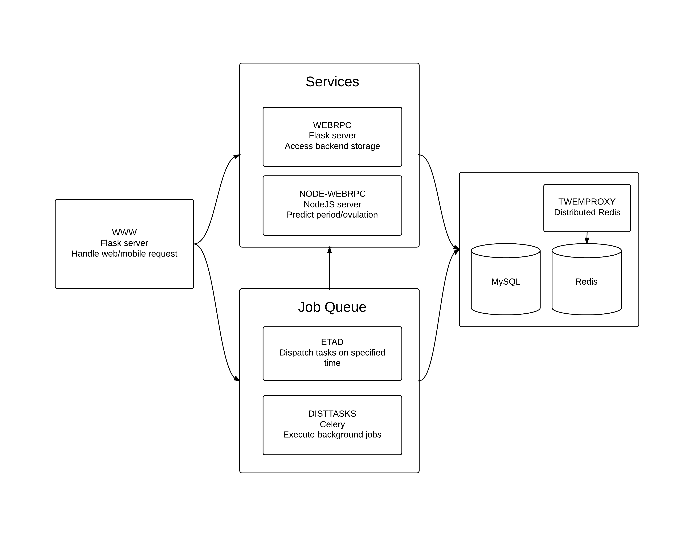

# 为何Python适合初创公司？
### 叶剑烨 - Glow Inc

 

---

# 内容提要
- Pyhon的简与雅
- 完整的生态圈
- Glow的实践
- 对Python的理解误区

---

#简

快速简洁是创业公司选择一项技术的关键性指标, 而Python在此方面表现出色

- 通俗易懂的语法
- 简短精悍的代码, 来自语言自身强大的表述力
- 简单有效的REPL开发模式

---

#简洁的代码来自强大的表述力

表述力越强则从逻辑思维的过程转化为代码的难度越低。换句话，表述力强的编程语言能更直接的描述人们的日常思维。

Python的表述力优势体现在以下语言特性
- List and dict comprehension
- High-order functions
- Reflection and meta programming

---

#例子1：单词记数

```python
import sys
from collections import Counter

content = sys.stdin.read().translate(None, deletechars='.,-!?')
count = Counter([w.strip().lower() for w in content.split(' ')])
for w, cnt in count.most_common():
    print '{} {}'.format(w, cnt)
```

---

#例子2: 一个RPC Server/client的实现
```python
class Foo(object):
    def add(self, x, y):
        return x + y

    def mul(self, x, y):
        return x * y

rpc_server = RPCServer(FooServer())
server_thread = Thread(target=lambda: rpc_server.run(port=9901))
server_thread.daemon = True
server_thread.start()
foo = RPCClient(host='localhost', port=9901)
print foo.add(1,2), foo.mul(3, 4) # 3 12
print foo.div(1,2) # raise exception: Method not found 
```

---

#例子2: RPC Server

Server端的实现共12行代码

```python
class RPCServer(Flask):
    def __init__(self, request_handler):
        super(RPCServer, self).__init__(__name__)
        self.request_handler = request_handler
        self.add_url_rule('/<method_name>', view_func=self.handle_request, methods=['POST'])

    def handle_request(self, method_name):
        method = getattr(self.request_handler, method_name, None)
        if not callable(method):
            return abort(404)
        params = json.loads(request.data)
        return json.dumps(method(*params['args'], **params['kwargs']))
```

---

#例子2: RPC Client

Client端的实现共15行代码

```python
class RPCClient(object):
    def __init__(self, host, port):
        self.base_url = 'http://{}:{}'.format(host, port)

    def __getattr__(self, method_name):
        return functools.partial(self.execute, method_name)

    def execute(self, method_name, *args, **kwargs):
        msg = json.dumps({'args':args, 'kwargs':kwargs})
        result = requests.post('{}/{}'.format(self.base_url, method_name), data=msg)
        if result.status_code == 200:
            return result.json()
        elif result.status_code == 404:
            raise Exception('Method not found: {}'.format(method_name))
        raise Exception('Unknown error')
```
---

#REPL的开发模式

editor + interactive shell即可组成高效的开发环境，这是动态语言的独特优势。

iPython是目前最好用的python shell， 与vim，emacs, sublime等通用编缉器可以很好的整合

个人的选择: Vim + ConqueTerm plugin + iPython

---

#雅

代码可读性与可维护性的重要程度不言而喻。创业公司因快速的开发节奏，通常没有独立的文档。因此，代码可读性变得更为关键。

Python的编程之道非常讲究可读性 (在python shell中`import this`)
- Beautiful is better than ugly.
- Explicit is better than implicit.
- Simple is better than complex.
- Complex is better than complicated.

---

#声明式代码

声明式代码描述目的（做什么），而命令式代码描述过程（怎么做），过程中的实现细节会干扰代码的可读性。

Decorator, Context Manager与Descriptor可以将许多命令式代码转为声明式代码。
- Decorator作用于函数
- Context Manager作用于Code block
- Descriptor作用于对象的属性

---

#例子 3: 函数缓存
```python
# in python 3.2+, just use functools.lru_cache 
def memorized(f):
    def _wrapped(*args, **kwargs):
        if not hasattr(f, '__cached_result'):
            f.__cached_result = {}
        cache_key = hash((tuple(args), tuple(kwargs.iteritems())))
        if cache_key not in f.__cached_result:
            f.__cached_result[cache_key] = f(*args, **kwargs)
        return f.__cached_result[cache_key]
    return _wrapped

@memorized
def fib(n):
    if n <= 0: return 0
    if n == 1: return 1
    return fib(n-1) + fib(n-2)
```

---

#例子 4: 数据库事务
```python
class DBTransaction(object):
    ''' A context manager that rollback db changes when execption raises '''
    def __init__(self, dbc):
        self.dbc = dbc

    def __enter__(self):
        self.dbc.begin()

    def __exit__(self, e_type, e_value, traceback):
        if e_type:
            self.dbc.rollback()
        else:
            self.dbc.commit()

with DBTransaction(cursor):
    cursor.execute(sql)
```

---

#Python的生态圈

除了服务端程序的开发，公司往往还要面对系统管理，开发与产生环境布署，数据分析与报表等其他需求。而创业公司往往一个人负责多项工作，所以全能型的编程语言就显得非常有吸引力。

一门编程语言的生态圈由2个因素决定
- 语言本身的泛用性
- 社区的积累

Python的第三方类库大全 [Awesome Python](https://github.com/vinta/awesome-python)

---

#常用的Python类库与工具

- 高性能web框架与HTTP服务器
    - flask, django (web框架)
    - gunicorn/uwsgi + gevent (HTTP服务器)
- 异步与后台工作队列: Celery, RQ
- 数据分析与科学计算：ipython-notebook + pandas, scikit-learn
- 服务器布署：fabric, ansible

---

#Python & Linux shell

绝大部分服务器端的工作都离不开shell, Python能否替代bash/zsh来编写shell script呢？

- 用Fabric来替代Shell script
- 用PythonPy来替代awk, sed和cut等命令行工具

---

#例子：Fabric
```python
@task
@hosts('prod-db0','prod-db1')
def fetch_db_backup_from_s3(date):
    dump_root = '/mnt/dump_%s' % date.replace('-', '_')
    sudo('mkdir -p %s' % dump_root)
    year, month, day = date.split('-')
    s3_link = 's3://dbbackup.glowing.com/prod/%(year)s/%(month)s/%(day)s/%(host)s.tgz' % {
                'year': year,
                'month': month,
                'day': day,
                'host': run('hostname')
            }
    with cd(dump_root):
        sudo('s3cmd -c /opt/hvf-ops/s3cfg get %s - | tar zxv' % s3_link)
```

---

#例子：PythonPy
```bash
# ipaddr.log
# Nov 11 23:59:59 prod-www1: 479539 76.254.19.241 1415750399.24
# Nov 11 23:59:59 prod-www0: 72057594048464603 68.84.178.64 1415750399.55
# Nov 11 23:59:59 prod-www1: 72057594048464603 68.84.178.64 1415750399.56
# Nov 11 23:59:59 prod-www0: 344465 24.188.234.103 1415750399.57
# ...
$ cat ipaddr.log | py -x "x.split(' ')[-2]"
76.254.19.241
68.84.178.64
...

$ cat ipaddr.log | py -x "x.split(' ')[-2]" | py -l "collections.Counter(l).most_common(5)"
('68.84.178.64', 10)
('76.254.19.241', 5)
...
```

---

#Glow的实践

Python是Glow服务器端的主力语言, 

- 服务器端有多个独立的组件，每个组件都是一个Flash搭建的Web Server，相互之间用HTTP远程调用。
- 用Celery来完成异步调用与后台计算
- 用Fabric布署生产环境, Boto库在AWS上初始化服务器
- 数据分析团队用Python编写数据分析API, 也使用iPython Notebook + pandas做adhoc分析和图表绘制。

---



---

#使用Python的疑虑

- Python的执行效率太差了
- 没有编译检查，不适合大型项目
- Django vs RoR
- 招不到好的Python程序员

---

#谢谢大家!

##我的微信号 ryanyewx
##[Glow正在招聘](http://t.cn/R7eA26O)


---

#Slide下载


---

